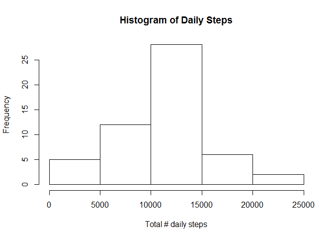
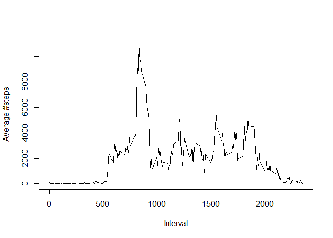
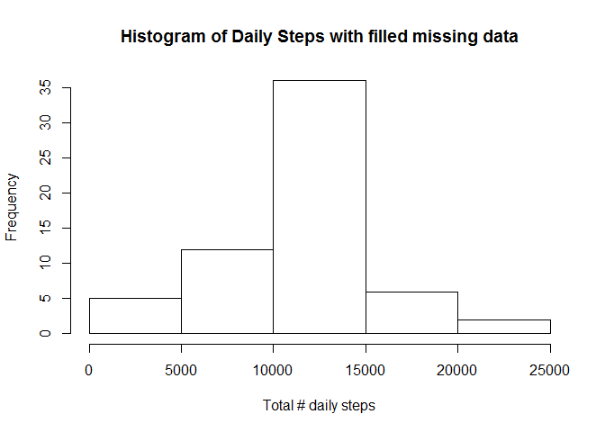

# Reproducible Research: Peer Assessment 1

## Loading and preprocessing the data

```r
df <- read.csv("activity.csv")
```

## What is mean total number of steps taken per day?

In order to ignore the missing data, the "final" data frame is created from "df", containing only the full rows. The steps values are aggregated per date, a histogram is created, and the mean and median are computed.


```r
final <- df[complete.cases(df),]
per_day <- aggregate(steps~date, data=final, sum)
hist(per_day$steps, xlab="Total # daily steps", main="Histogram of Daily Steps")
```

 

```r
mean_steps <- mean(per_day$steps)
median_steps <- median(per_day$steps)
```
The mean of the total steps per day is: 


```r
mean_steps
```

```
## [1] 10766.19
```
The median of the total steps per day is: 


```r
median_steps
```

```
## [1] 10765
```

## What is the average daily activity pattern?

In order to answer the question the steps are aggregated per time interval.


```r
per_interval <- aggregate(steps~interval, data=final, sum)
max_interval <- per_interval[which.max(per_interval$steps),]
plot(per_interval$interval, per_interval$steps, type="l", xlab="Interval", ylab="Average #steps")
```

 

The 5-minute interval which on average contains the maximum number of steps is 835.


## Imputing missing values

The activity dataset contains missing values. In this section the missing step values are substituted with the mean of the corresponding interval.

```r
missing_rows <- nrow(df) - sum(complete.cases(df))
```

The number of rows with missing data is 2304.

The mean of each interval is computed:


```r
per_interval_mean <- aggregate(steps~interval, data=final, mean)
```

A new dataset "df_filled" is created from "df". Foreach observation that has a missing steps value, the NA is substituted with the mean of the corresponding interval (mean is taken from "per_interval_mean").

```r
df_filled <- df
for (i in 1:nrow(df_filled)) {
    obs <- df_filled[i, ]
    if (is.na(obs$steps)) {
        df_filled[i,1] <- subset(per_interval_mean, interval == obs$interval)$steps
    } else {
        df_filled[i,1] <- obs$steps
    }
}
```

The mean and median are computed from the filled dataset.


```r
per_day_filled <- aggregate(steps~date, data=df_filled, sum)
hist(per_day_filled$steps, xlab="Total # daily steps", main="Histogram of Daily Steps with filled missing data")
```

 

```r
mean_steps_filled <- mean(per_day_filled$steps)
median_steps_filled <- median(per_day_filled$steps)
```

The mean of the total steps per day is: 


```r
mean_steps_filled
```

```
## [1] 10766.19
```
The median of the total steps per day is: 


```r
median_steps_filled
```

```
## [1] 10766.19
```

The mean value is the same as in the first part of the assignment. The median is a bit different. 

The impact of imputting missing data is that the mean stays the same, but the frequency values of the histogram got larger as expected (due to new data).

## Are there differences in activity patterns between weekdays and weekends?

The rows of the dataset are tagged with the value "weekend" or "weekday". This is accomplished by interpreting the date.

```r
library(lattice)
library(lubridate)
```

```
## Warning: package 'lubridate' was built under R version 3.1.2
```

```r
for (i in 1:nrow(df_filled)) {
    date <- ymd(df_filled[i,2])
    day_in_week <- wday(date)
    
    if ((day_in_week == 1) || (day_in_week == 7)) {
        df_filled$day_type[i] <- "weekend"
    }
    else {
        df_filled$day_type[i] <- "weekday"
    }
    
}

df_filled$day_type <- factor(df_filled$day_type)
```

The steps are now aggregated per interval and day_type (weekend/weekday).

```r
per_interval <- aggregate(steps~interval+day_type, data=df_filled, mean)
xyplot(steps ~ interval | day_type, per_interval, type = "l", layout = c(1, 2), xlab = "Interval", ylab = "Number of steps")
```

 

The plot shows that during weekdays there's a peak of activity in the morning hours, and then the activity drops by half. In the weekends the activity level is high for several hours (till the evening).
